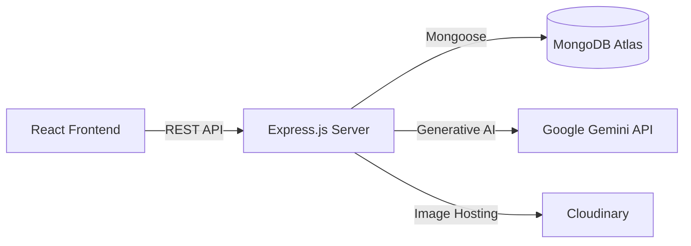
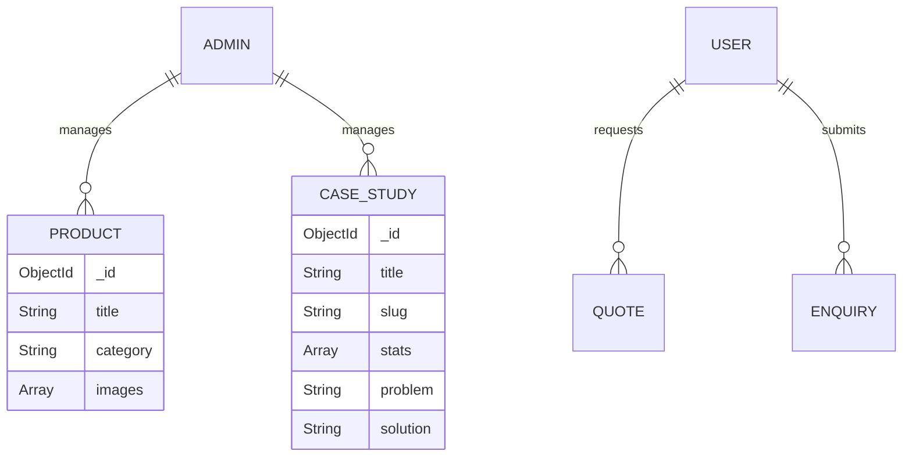
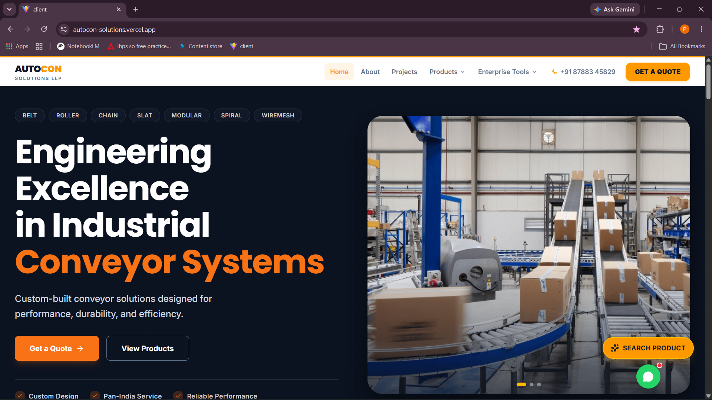
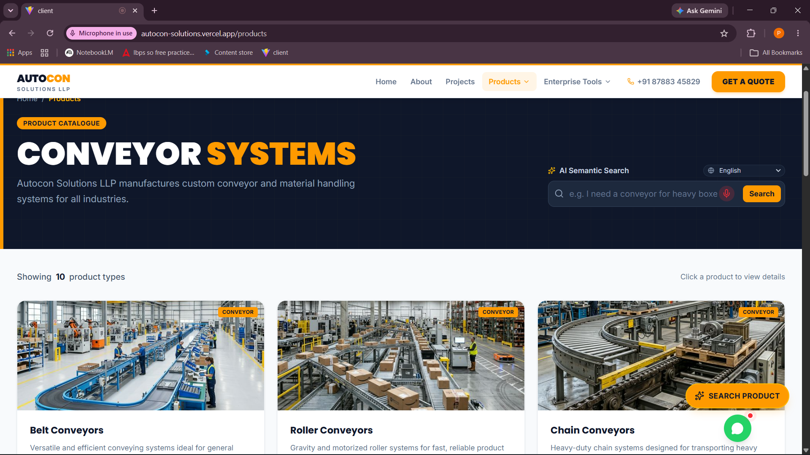
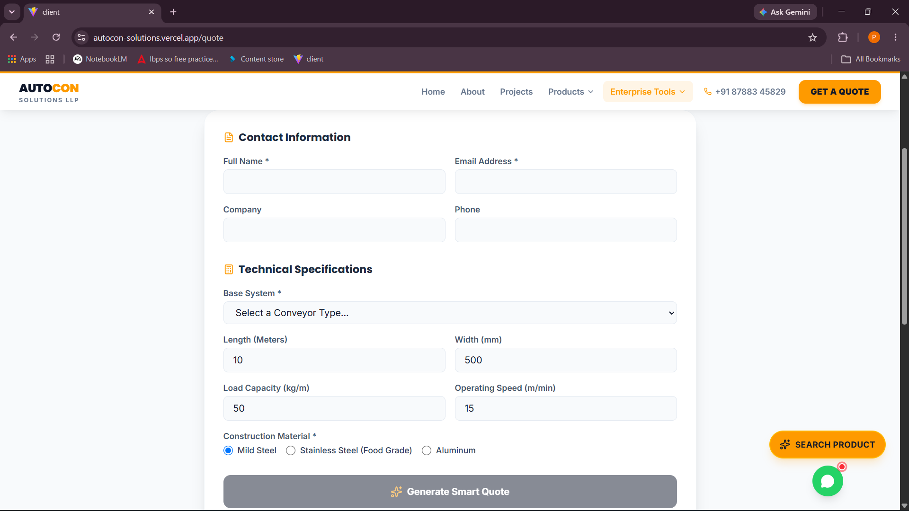
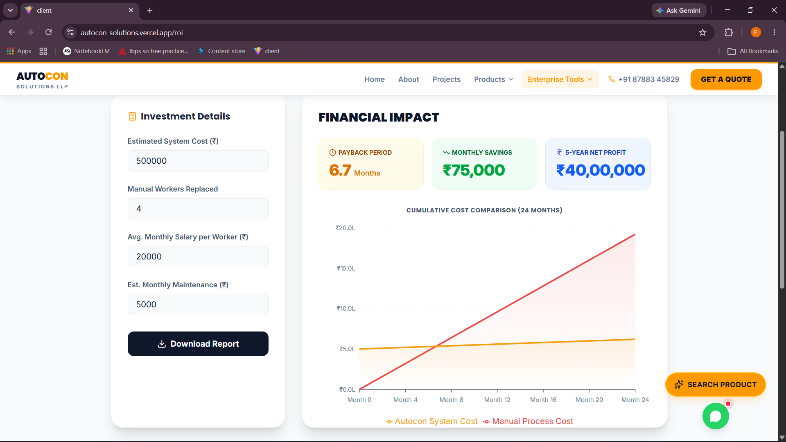
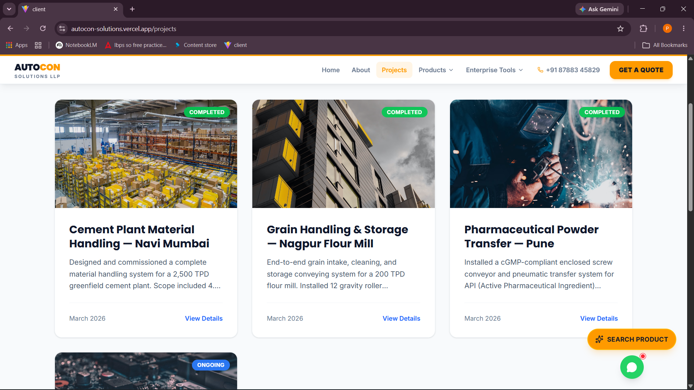
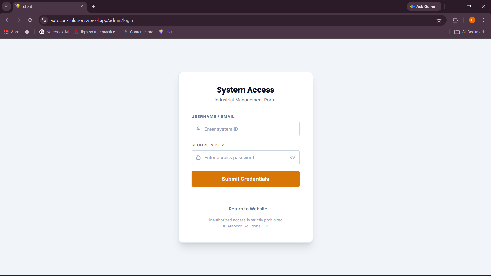

<div align="center">


# 🏭 Autocon Solutions
**Enterprise-Grade Industrial Automation & AI Sales Platform**

[](https://reactjs.org/)
[](https://nodejs.org/)
[](https://www.mongodb.com/)
[](https://tailwindcss.com/)
[](https://deepmind.google/technologies/gemini/)

[Live Demo](https://autocon-solutions.vercel.app) · [Report Bug](https://github.com/prathameshkamble979/Autocon-Solutions/issues) · [Request Feature](https://github.com/prathameshkamble979/Autocon-Solutions/issues)

</div>

---

## 📖 Overview

**Autocon Solutions** is a modern, full-stack B2B platform engineered for industrial automation and conveyor system manufacturers. It transcends traditional static brochure websites by integrating a powerful **AI-driven Sales Suite** that automates presales workflows, provides instant intelligent product searches, and generates boardroom-ready proposals.

Built on the **MERN Stack** (MongoDB, Express, React, Node.js), this application combines a stunning, high-performance user interface with a robust, secure administrative backend.

---

## ✨ Key Features

### 🤖 AI-Powered Enterprise Suite (Google Gemini Integration)
* **Voice-Activated Semantic Search:** A global floating AI button allows users to click, speak their industrial requirements, and instantly receive highly relevant product matches.
* **Smart Quote Builder:** AI-driven price estimation that analyzes material, dimensions, and load requirements to generate instant approximations.
* **ROI Calculator:** Calculates payback periods and long-term financial savings for prospective clients upgrading their assembly lines.
* **Proposal Generator:** Drafts professional, boardroom-ready PDF proposals using generative AI based on client inputs.

### 💼 Core Business Modules
* **Interactive Product Catalogue:** High-performance, categorized product browsing with detailed specifications and image galleries.
* **Rich Case Studies:** Detailed project breakdowns featuring problem/solution architectures, key metrics, and dynamic image lightboxes.
* **Secure Admin Dashboard:** A protected management panel to oversee product inventory, case studies, client enquiries, and generated quotes.

### 🎨 Premium UI/UX Design
* **Industrial Aesthetic:** A curated `Slate-900` and `Amber-500` color palette reflecting heavy machinery and engineering excellence.
* **Micro-Animations:** Fluid transitions, staggered list loads, and interactive hover states powered by `Framer Motion`.
* **Fully Responsive:** Flawless experience across desktop, tablet, and mobile devices.

---

## 🏗️ Architecture

### System Flow


### Database Schema (Simplified)


---

## 📸 Screenshots

> **Note:** Add screenshots to the `docs/assets/` directory and uncomment the lines below.


### Home Page & Hero Section


### AI Voice Search & Product Catalogue


### Enterprise Sales Tools



### Project Details & Modal


### Admin Dashboard Login



---

## 💻 Tech Stack

**Frontend Framework & Libraries**
* **React 19** + **Vite**
* **Tailwind CSS v4** (Utility-first styling)
* **Framer Motion** (Advanced animations)
* **React Router DOM v7** (Routing)
* **React Hook Form + Zod** (Form validation)
* **Lucide React** (Iconography)

**Backend Architecture**
* **Node.js + Express.js**
* **MongoDB + Mongoose** (Database & ODM)
* **Google GenAI API** (LLM Integration)
* **Cloudinary** (Cloud image storage)
* **JWT + Bcrypt** (Authentication & Security)
* **NodeCache** (API Response Caching)

---

## 🚀 Getting Started

Follow these instructions to set up the project locally.

### Prerequisites
* Node.js (v18 or higher)
* MongoDB database (Local or Atlas)
* Google Gemini API Key
* Cloudinary Account (for image uploads)

### 1. Clone the repository
```bash
git clone https://github.com/prathameshkamble979/Autocon-Solutions.git
cd Autocon-Solutions
```

### 2. Set up the Backend
```bash
cd server
npm install
```

Create a `.env` file in the `server` directory:
```env
PORT=5000
MONGO_URI=your_mongodb_connection_string
JWT_SECRET=your_jwt_secret_key
CLOUDINARY_CLOUD_NAME=your_cloud_name
CLOUDINARY_API_KEY=your_api_key
CLOUDINARY_API_SECRET=your_api_secret
GEMINI_API_KEY=your_gemini_api_key
EMAIL_USER=your_smtp_email
EMAIL_PASS=your_smtp_password
```

Start the backend server:
```bash
npm run dev
```

### 3. Set up the Frontend
```bash
# Open a new terminal
cd client
npm install
```

Create a `.env` file in the `client` directory:
```env
VITE_API_URL=http://localhost:5000/api
```

Start the development server:
```bash
npm run dev
```

---

## 🌍 Deployment Options

The application is containerized and optimized for modern cloud hosting.

* **Frontend:** Recommended to deploy on **Vercel** or **Netlify**. Ensure you set the `VITE_API_URL` environment variable to your live backend URL.
* **Backend:** Recommended to deploy on **Render** or **Railway**. Ensure all backend environment variables are securely added to the hosting platform.
* **Database:** **MongoDB Atlas** is highly recommended for production databases.

---

## 🛣️ Future Roadmap

- [ ] **Multi-language Support (i18n):** To cater to international industrial clients.
- [ ] **3D Product Visualizer:** Interactive Three.js models for complex conveyor systems.
- [ ] **Automated PDF Quotations:** Direct email dispatch of generated PDF proposals to clients.
- [ ] **Client Portal:** Secure login area for clients to track active project progress and invoices.

---

## 👨‍💻 Author

**Prathamesh Kamble**

* 🔗 LinkedIn: [linkedin.com/in/prathamesh-kamble06](https://www.linkedin.com/in/prathamesh-kamble06/)
* 📧 Email: [prathameshdk06@gmail.com](mailto:prathameshdk06@gmail.com)
* 🐙 GitHub: [@prathameshkamble979](https://github.com/prathameshkamble979)

---

## 📜 License

This project is licensed under the MIT License - see the [LICENSE](LICENSE) file for details.

<div align="center">
  <i>Engineered with precision for the future of industrial automation.</i>
</div>
